# 
**Escuela Politécnica Nacional**

## 
**Business Intelligence**

### **Integrantes:**
- Juan Cofre
- Fernando Huilca
- Sebastián León
- Gregory Salazar
- Mateo Simbaña

------------

## 1. Ejemplo 01: JSON y calculator
Se diseñó una transformación (.ktr) que consta de los siguientes pasos:

### 1.1. Extracción (JSON Input)

Se cargó el archivo `carrito.json` que contiene una estructura jerárquica de datos representativa de una respuesta de API de comercio electrónico.

| | |
| :---: | :---: |
|  |  |

 

Para la lectura de los datos, se configuró el `"Source path"` en la pestaña `Fields` utilizando la `ruta $.[*].` Esto permite que Spoon, la interfaz gráfica de PDI, itere sobre cada objeto del arreglo para extraer los campos `producto`, `precio` y `cantidad`.

Se definieron manualmente los campos en la tabla de mapeo, especificando el tipo de dato Number para el precio e Integer para la cantidad, asegurando la compatibilidad con pasos posteriores del flujo ETL.

| | |
| :---: | :---: |
|  |  |

 

### 1.2. Transformación (Calculator)

Se utilizó el componente Calculator, ubicado en la categoría Transform, para procesar los datos extraídos. Se configuró una operación aritmética de `tipo A * B` para calcular el valor total por producto.

Se definió el campo de salida como Subtotal, asignando precio como el campo A y cantidad como el campo B, generando así información financiera de valor agregado para el análisis de negocio.

| | |
| :---: | :---: |
|  |  |

 

### 1.3. Carga (Microsoft Excel Writer)

Para la etapa de carga, se empleó el componente Microsoft Excel writer, con el fin de exportar los resultados a un formato compatible con herramientas de oficina tradicionales.

Se configuró el nombre del archivo de salida como Analisis_Carrito_API.xls y se utilizó la función Get Fields para organizar las columnas, incluyendo el nuevo campo calculado en la transformación anterior.

| | |
| :---: | :---: |
|  |  |

 

### 1.4. Resultados 

La ejecución del flujo se completó exitosamente, facilitando la actualización y mantenimiento de los datos procesados.

En la imagen final se observa el archivo de salida generado, donde se verifica que el sistema procesó correctamente el archivo JSON original y añadió la columna de cálculo matemático para cada registro de forma automática.

  

 

---

## 2. Ejemplo 02: Text File Input y String operations

### 2.1 Extracción (File text)
Para este ejemplo se utilizó la entrada de "File text input" la cual permite cargar un archivo de texto plano.

  - Se configuró para leer un archivo de texto con datos sucios.
  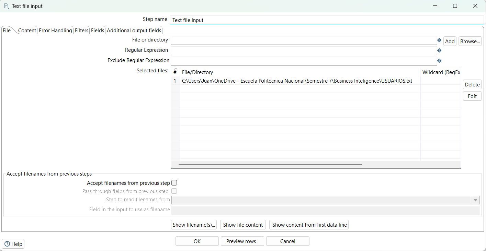
  - En la pestaña "Content" es importante verificar que el separador sea ";".
  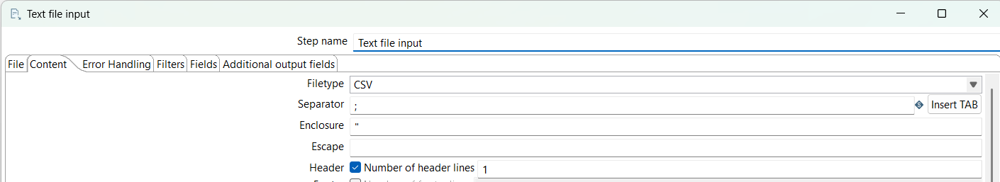
  - En la pestaña "fields" a través de la opción de "get fields" obtenemos el mapeo de las tres columnas: `id`, `nombre_ciudad`, `ciudad`.
  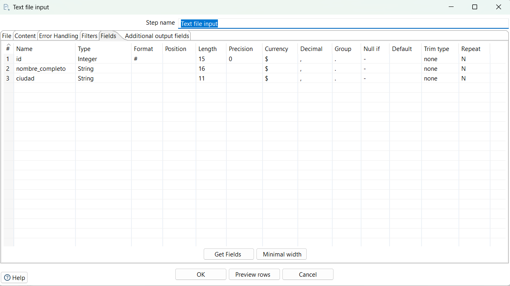
  - Y con la opción de "Preview rows" se puede obtener una previsualización de los datos del archivo de entrada.
  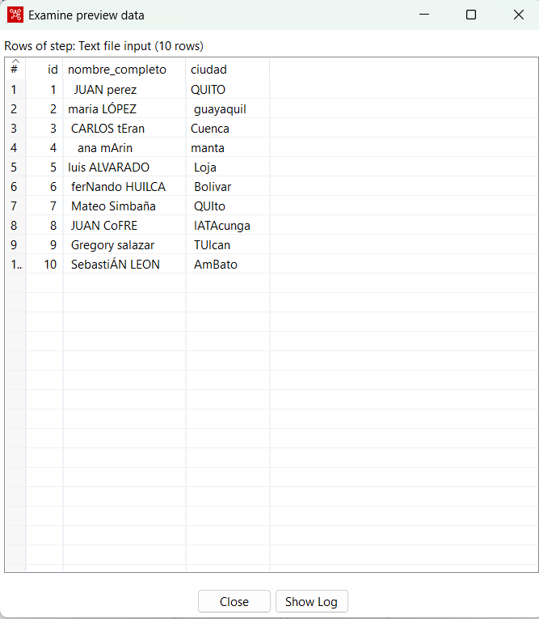

### 2.2 Transformación (String operations)
La transformación utilizada fue la de String operations con la cual se aplicaron reglas específicas por columna para garantizar la uniformidad:
  - `nombre_completo`: Se aplicó un Trim tipo "Both" para eliminar espacios accidentales en los extremos y se transformó a "Upper Case" (Mayúsculas) para estandarizar registros.
  - `ciudad`: Se aplicó un Trim tipo "Both" y se transformó a "Lower Case" (Minúsculas) para facilitar agrupaciones de datos.

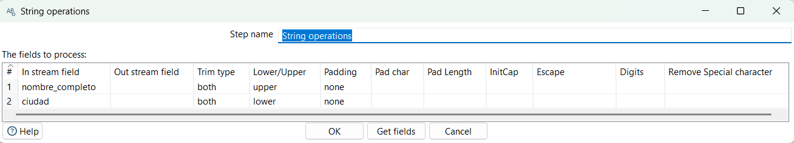

### 2.3 Carga (File text output)
La transformación se carga también en un archivo de texto para lo cual se utiliza la salida de `File text output`.

Esta salida solo requiere colocar el nombre del archivo resultante y la ubicación en donde se va a guardar.

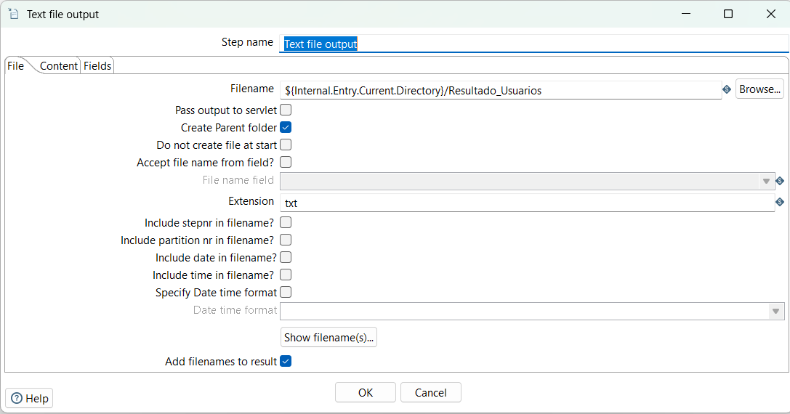

### 2.4 Resultados

Ejecución exitosa

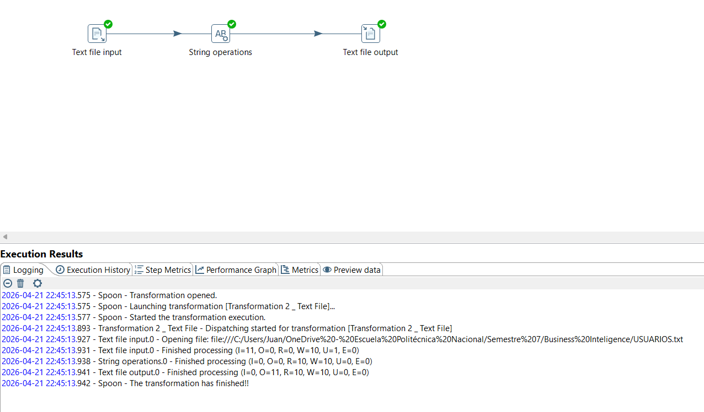

Resultados de la transformación:

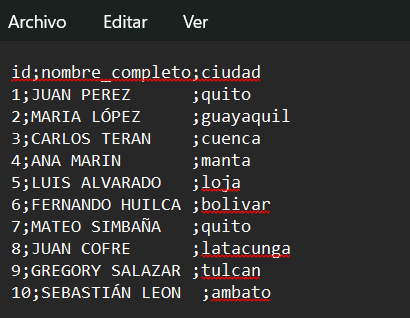

---

## 3. Ejemplo 03: Data Grid, Select Values y Concat Fields

### 3.1. Extracción (Data Grid)

Se seleccionó el input "Data Grid" (Tabla simulada que se crea manualmente en Pentaho).

 - Se hizo doble clic en el ícono del input.
 
 - En la pestaña "Meta" se crearon las columnas anio, mes y numero_pedido con el "Type" Integer. 
 
 
    
  - En la pestaña "Data" se ingresaron los registros con valores numéricos para cada columna. Por ejemplo:

  

### 3.2. Transformación usando Select Values

Se seleccionó el transform "Select Values" para corregir el formato de los números. 
 
 - Se hizo doble clic en el ícono del transform.
 
 - En la pestaña "Meta-data" se pulsó en "Get fields to change" para cargar las columnas del input.
 
 - Se cambió el "Type" de las columnas a "String" y se colocó en "Format" a la estructura deseada para cada columna. Por ejemplo:
 
 

### 3.3. Transformación usando Concat Fields

Se seleccionó el transform "Concat Fields" para concatenar las columnas y crear el ID único.

  - Se hizo doble clic en el ícono del transform.
    
  - Se puso en "Target Field Name" el nombre del nuevo campo, por ejemplo "ID_Factura".

  - En "Separator" se colocó el carácter que se desea usar para separar los valores, por ejemplo "-".
  
  

### 3.4. Carga (Microsoft Excel Writer)

Para un formato de salida más legible, se seleccionó el output "Microsoft Excel Writer" con el nombre y la ruta deseada para guardar el resultado.

 

### 3.5. Resultados

 Ejecución exitosa.

 

 Archivo generado satisfactoriamente.

 

---

## 4. Ejemplo 04: XML_Add sequence

### 4.1. Extracción (Get data from XML)
Se cargó el archivo `plant_catalog.xml` que contiene datos en una estructura jerárquica en formato XML.

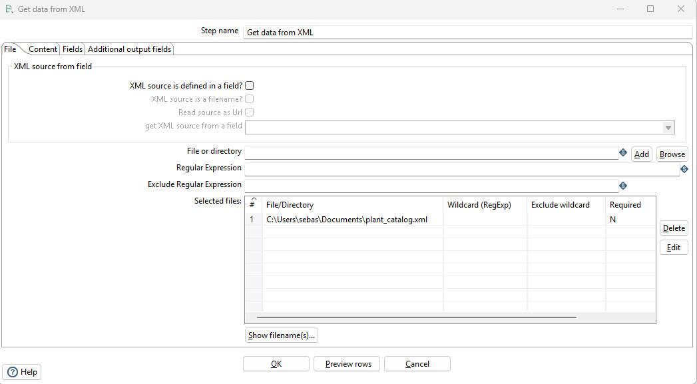

Para su lectura, se configuró el componente "Loop XPath" utilizando la ruta `/CATALOG/PLANT`, permitiendo iterar sobre cada elemento PLANT del catálogo y e extraer campos específicos como COMMON (nombre común), ZONE (zona) y PRICE (precio).

 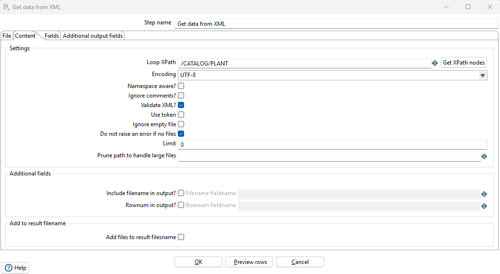

Se obtuvieron los datos utilizando el botón `GetFields` y se completó el campo Name.

 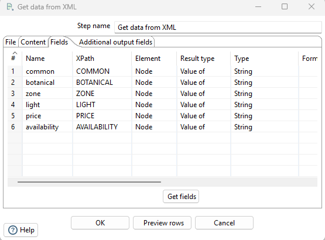

Se previsualizaron las filas para verificar que se estén leyendo correctamente los datos del archivo .xml.

 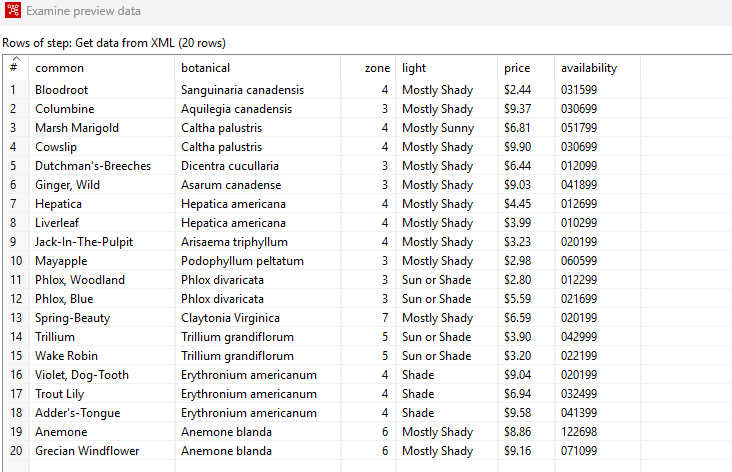

### 4.2. Transformación (Add Sequence)
Se utilizó el componente Add Sequence para generar un número secuencial de forma automática y añadirlo como una nueva columna a cada registro. En el campo Name of value se definió el nombre `id_planta`, para identificar de manera única a cada elemento extraído.

  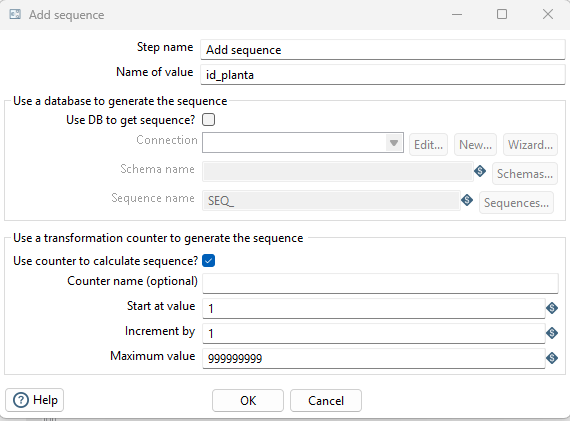

### 4.3. Carga (XML Output)
Se utilizó el componente XML Output para almacenar los datos transformados en un nuevo archivo en formato XML. Se configuró el nombre del archivo de salida como `output_plant_catalog.xml`.

 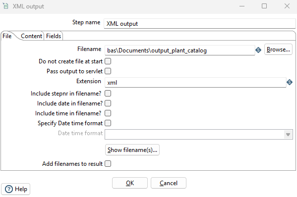
 
Se especificó el Parent XML element como `catalog` y el Row XML element como `plant`, esto para definir la estructura jerárquica del archivo de salida.

 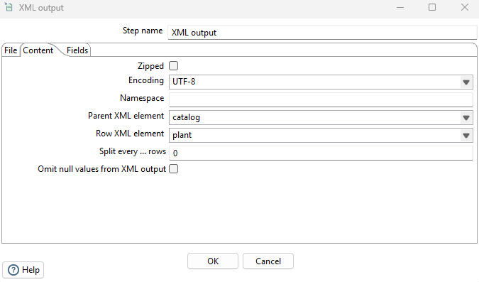

Se organizó el orden de los campos en el formato de salida. En caso de no especificar el Element name, el sistema utiliza por defecto el nombre del campo como etiqueta XML.

 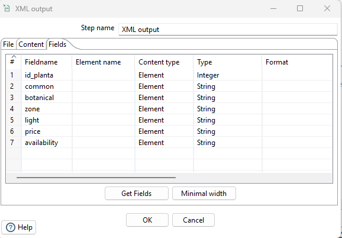
 
### 4.4. Resultados
La ejecución fue exitosa.

 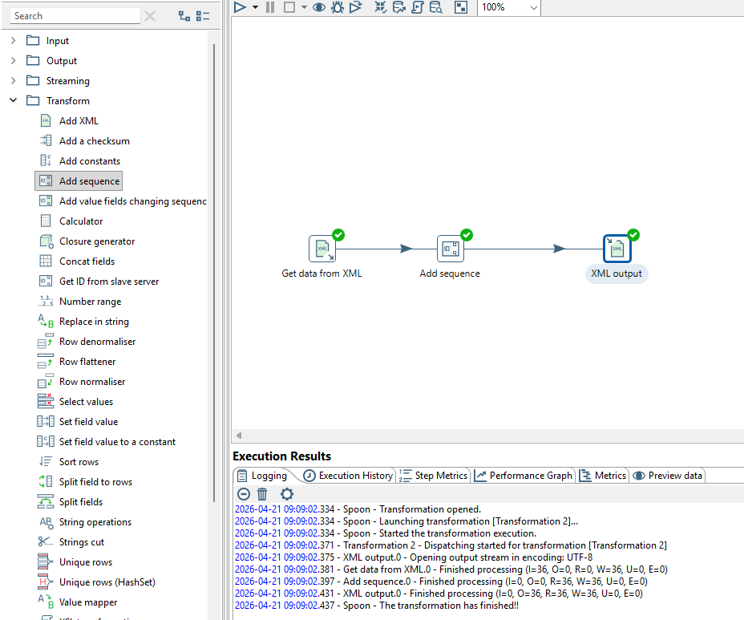

En la siguiente imagen se puede visualizar el archivo de entrada (sección izquierda) y el archivo de salida (sección derecha), donde ahora se incluye un identificador único para cada planta.

 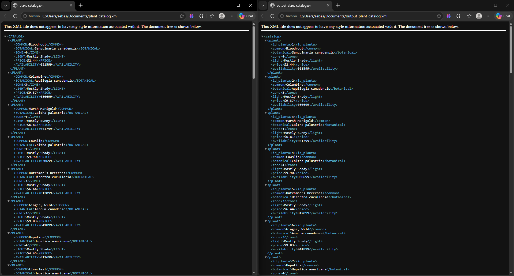

## 5. Ejemplo 05: CSV_Sort rows

### 5.1. Extracción (Get data from CSV)
Primero, se cargó el archivo con extensión .csv, denominado Input FactSale.csv. Para su lectura, se configuró el componente "Delimiter" con el valor coma (,), dado que este carácter se utiliza en el archivo para separar los datos en columnas. Además, se marcó la casilla "Header row present?", puesto que el archivo contiene una fila inicial con los nombres de las columnas.

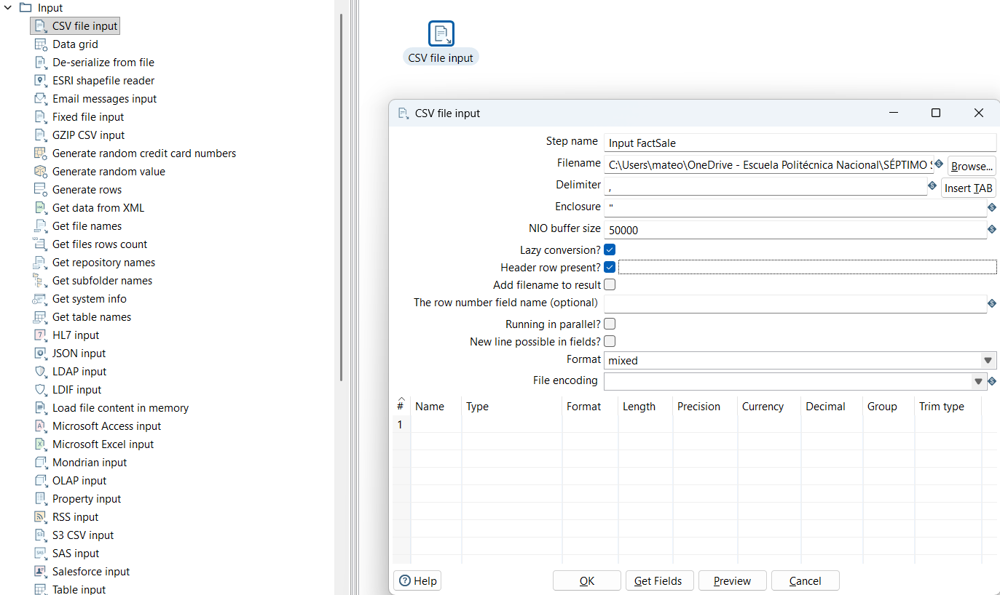

Luego, se obtuvieron los nombres de las columnas con el botón `GetFields`.

 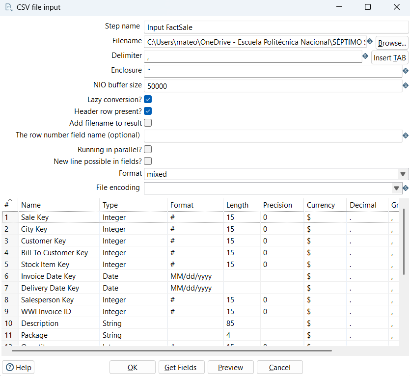

Después, se previsualizaron las filas para verificar que se estén leyendo correctamente los datos del archivo cargado.

 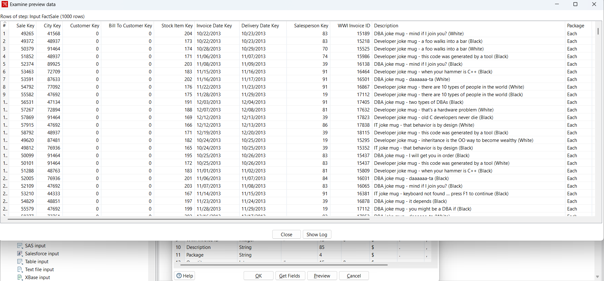

### 5.2. Transformación (Sort rows)
Se utilizó el componente Sort Rows con la finalidad de ordenar los registros de venta por las columnas `Invoice Date Key` y `Total Including Tax`. Se agregaron ambas columnas en el componente y en el campo "Ascending" se seleccionó "N" en los dos casos para lograr un orden descendente que muestre primero las fechas más recientes y, dentro de ellas, los valores de venta más altos.

  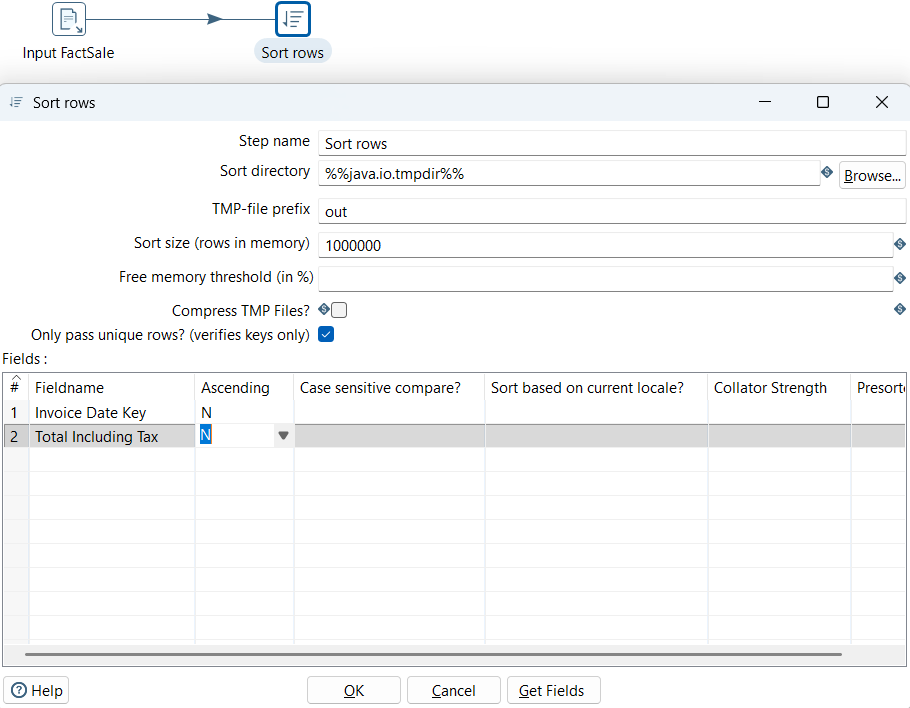

### 5.3. Carga (Microsoft Excel writer)
Se utilizó el componente Microsoft Excel writer para almacenar los datos transformados en un nuevo archivo con extensión .xls. Se configuró el nombre del archivo de salida como `Output FactSale.xls` y se especificó la ruta donde debe almacenarse.

 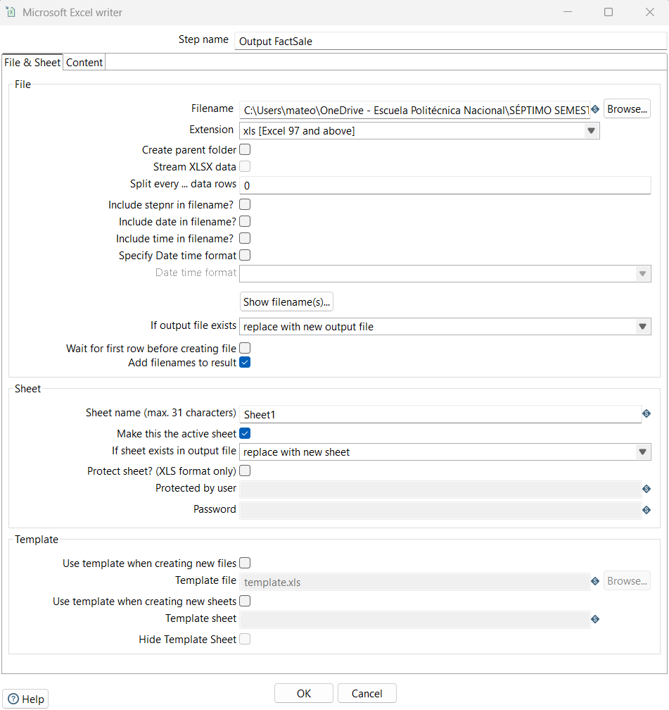

Además, en la pestaña `Content`, se estableció el formato `m/d/yy` para los campos `Invoice Date Key` y `Delivery Date Key`.
 
 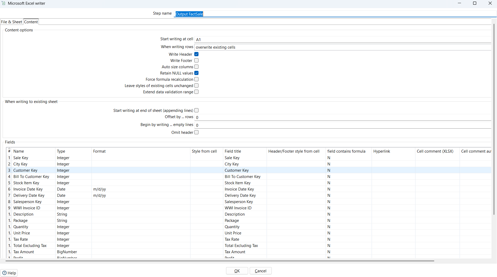

### 5.4. Resultados

En la siguiente imagen se muestra el archivo de entrada (lado izquierdo) y el archivo de salida (lado derecho), donde ahora los registros de venta están ordenados en forma descendente según la fecha de emisión de la factura y el valor total incluido impuestos.

 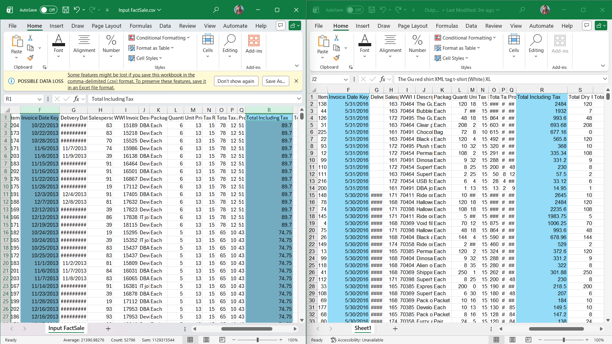
